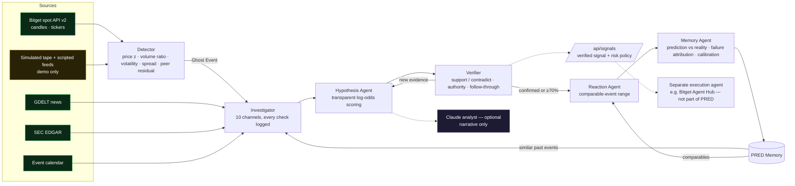

# PRED — Predictive Reaction Event Detector

**Find what the market knows before the news says it.**

> Traditional markets close. Information doesn't. PRED watches the gap.

PRED provides 24/7 market event intelligence for tokenized U.S. equities. It is **not** a stock predictor and **not** a trading bot.

Tokenized equities trade around the clock, while the underlying U.S. market is open for only 6.5 hours a day. Outside those hours, price and volume can react before the traditional market opens and before any news explains the move. PRED detects these unexplained moves, called **Ghost Events**. It then turns each one into structured, testable hypotheses, tracks them until they are confirmed or invalidated, estimates the likely market reaction, and learns from the outcome.

```
DETECT → INVESTIGATE → HYPOTHESIZE → VERIFY → PREDICT → LEARN
```

Built for the **Bitget AI Genesis Season 2** hackathon.

---

## Quick start

```bash
node --version        # >= 20
npm start             # http://localhost:8787
npm test              # 21 tests: detector, calendar, hypotheses, verifier, memory, sources, full demo lifecycle
npm run demo:cli      # the whole lifecycle, headless, printed as a timeline
```

PRED has no runtime dependencies. `@anthropic-ai/sdk` is optional and is only used when `ANTHROPIC_API_KEY` is set.

Open the dashboard and press **Start demo → / Next step** (or **Auto-play**). You can also press → or Space to advance.

## What a judge sees in Demo mode (15 steps, deterministic, clearly labeled SIMULATED)

| # | Step | What actually happens |
|---|------|------------------------|
| 1 | Select NVDAx | NVDAx, its semiconductor peers and BTC are monitored |
| 2 | Start monitoring | It is **Sunday 17:00 ET, so the U.S. market is closed**. 3 hours of history load, then 1-minute bars stream in |
| 3 | Trigger abnormal movement | NVDAx rises +2.34% on +640% volume. The **Detector genuinely detects it**; nothing about the detection is scripted |
| 4 | Ghost Event | `GHOST EVENT #184 · NVDAx +2.34% · Volume +640% · US MARKET CLOSED · CATALYST: UNKNOWN` |
| 5 | Investigate | 10 investigation channels run. Every source reports a status, including the ones that found nothing |
| 6 | Evidence graph | The Catalyst Graph builds itself: asset → anomalies → correlations → information signals |
| 7 | Hypotheses | Company-specific 67% · Unknown 15% · Sector 7% · … each with evidence for and against, and the weights used |
| 8 | Confidence | State becomes AWAITING CONFIRMATION. Action posture: WAIT |
| 9 | Fast-forward | Overnight, the move holds and discussion accelerates. **New revisions are appended; earlier ones are never overwritten** |
| 10 | Reveal | A *simulated* official NVIDIA release appears on the simulated news feed. The Verifier finds it and promotes it to authoritative evidence |
| 11 | Confirmed | **CATALYST CONFIRMED**, showing the original hypothesis (67%), the confirming evidence, and detection → confirmation time (13h 50m) |
| 12 | Reaction prediction | Expected reaction: positive, +1.66% → +3.87%, estimate +2.36%, confidence 85%, from 26 comparable events |
| 13 | Actual reaction | Time runs through Monday's session. At the 16:00 ET close the actual reaction is **+3.44%**: direction ✓, range ✓, catalyst ✓ |
| 14 | PRED Memory | The event is stored as #184 and becomes a comparable for future events |
| 15 | Accuracy | Direction, catalyst and range accuracy, time to confirmation, false-positive rate, failure attribution, and calibration over time |

The demo reaches "confirmed" and "correct" because the scenario was written that way. The 183 seeded memory events, however, are a **simulated backtest**: synthetic events with a hidden true cause, run through PRED's real hypothesis, reaction and evaluation code (walk-forward). Their accuracy and calibration numbers are real measurements of PRED's models, on synthetic data. The seed includes plenty of wrong calls: 13 false hypotheses, 26 liquidity anomalies, 87 unresolved events, and a Brier score of about 0.20.

## Live mode

LIVE mode connects to **Bitget's public market-data API (spot v2)**:

- It discovers tokenized-equity symbols from `/api/v2/spot/public/symbols`. Candidates are `NVDAX`, `NVDAON`, and similar; set `PRED_SYMBOL_MAP=NVDAx=NVDAXUSDT,...` to override.
- It backfills and polls 1-minute candles from `/api/v2/spot/market/candles` and quotes (bid/ask for spread) from `/api/v2/spot/market/tickers`.
- News comes from GDELT DOC 2.0 (keyless), filings from **SEC EDGAR** (set `SEC_USER_AGENT`), and scheduled events from a calendar file you maintain (`data/calendar.json`, see `data/calendar.example.json`).
- Social / web signals are shown as **not connected**. PRED shows a missing source as missing and does not invent one.

If Bitget is unreachable, the UI says so ("Market data: Bitget spot API · unreachable") and **no data is simulated in LIVE mode**. Live events persist to `data/memory-live.json`. Live memory starts empty, so the Reaction Agent returns "insufficient history" until real outcomes accumulate. Set `PRED_LIVE_BOOTSTRAP_SEED=1` to borrow the simulated backtest as comparables; those records keep their SIMULATED label.

```bash
npm run check:bitget   # which tokenized equities Bitget lists + candle/ticker check
```

| Env var | Default | Purpose |
|---|---|---|
| `PORT` | 8787 | HTTP port |
| `PRED_LIVE` | `1` | `0` disables the Bitget poller |
| `PRED_MONITORED` | `NVDAx,AMDx,AVGOx,TSMx,TSLAx,COINx` | monitored tickers (see `src/market/universe.js`) |
| `PRED_POLL_MS` | 20000 | Bitget poll interval |
| `PRED_SYMBOL_MAP` | — | explicit ticker → Bitget symbol mapping |
| `SEC_USER_AGENT` | — | required by SEC EDGAR (name + contact email) |
| `ANTHROPIC_API_KEY` | — | enables the Claude analyst narratives |
| `PRED_CLAUDE_MODEL` | `claude-opus-5` | analyst model |
| `PRED_CALENDAR` | `data/calendar.json` | scheduled-events file |

## Architecture



### Six agents, each with one job

| Agent | File | Job |
|---|---|---|
| **Detector** | `src/agents/detector.js` | For a 5-minute window against a 120-bar baseline, measures the price z-score, volume ratio (vs. median), intrabar volatility ratio, spread change, and peer/crypto moves with the residual move. It proposes a Ghost Event only when the U.S. regular session is closed |
| **Investigator** | `src/agents/investigator.js` | Converts measurements into evidence and runs information sources in parallel with timeouts. It records each source's status (`ok` / `unavailable` / `not_configured`) and emits an explicit "no coverage found" item instead of silence |
| **Hypothesis Agent** | `src/agents/hypothesis.js` | Six catalyst categories. Each evidence item adds a signed log-odds weight (`signalsFor`); scores go through a softmax at temperature 1.5, are capped at 90% until authoritative evidence exists, and every category keeps a floor. Output: probability, evidence for and against (with weights), confidence, affected assets, and implication |
| **Verifier** | `src/agents/verifier.js` | Classifies new evidence as SUPPORTS / CONTRADICTS / NEUTRAL, promotes official releases and 8-K/6-K filings to authoritative evidence, and checks price retention at +60 and +180 minutes. It judges the hypothesis that was **leading before** the authoritative evidence arrived |
| **Reaction Agent** | `src/agents/reaction.js` | Weighted 20th/50th/80th percentiles of comparable outcomes. Before confirmation, the reference class is "events where PRED initially led with this category" (which prices in being wrong). After confirmation, it is "events confirmed as this category" |
| **Memory Agent** | `src/agents/memory.js` | Persists every event and scores direction, range and catalyst accuracy, time to confirmation, and false-positive rate. It attributes failures to one of 7 categories and reports calibration (a reliability diagram plus Brier score over time) |

The **engine** (`src/core/engine.js`) runs the lifecycle state machine: `DETECTED → INVESTIGATING → HYPOTHESIS_CREATED → AWAITING_CONFIRMATION → CONFIRMED / INVALIDATED / UNRESOLVED`. Timelines, hypothesis revisions and predictions are **append-only**. You can step through every revision in the UI.

### Data provenance is explicit everywhere

Every evidence item, memory record and graph node carries one of these labels:

- `LIVE`: real-time data from Bitget, GDELT or EDGAR
- `HISTORICAL`: from PRED Memory
- `SIMULATED`: demo tape, scripted feeds, or the backtest seed
- `AI HYPOTHESIS`: model output (hypotheses, narratives, estimates)

Probabilities are labeled as *model confidence estimates*, and reaction outputs as *model estimates, not price targets*.

### Optional action layer

PRED recommends one of four postures: **MONITOR / WAIT / RESEARCH / CONSIDER TRADE**. It never places orders. A `CONSIDER_TRADE` posture requires a confirmed catalyst, reaction confidence of at least 60%, and an estimated move of at least 1% before the horizon. That signal is published at `GET /api/signals` together with a **risk policy** the consuming agent must enforce: maximum notional, maximum position as a percentage of equity, stop-loss, expiry at the horizon, human approval above a threshold, and a kill switch. `examples/execution-agent.mjs` is a dry-run reference consumer that shows how a separate Bitget Agent Hub execution agent would plug in.

### Claude analyst (optional)

With `ANTHROPIC_API_KEY` set, each hypothesis revision gets a short narrative from Claude. The narrative must cite evidence IDs and may use **only** the collected evidence. It never changes the probabilities, which come from the auditable scoring model. Without a key, PRED writes a deterministic template narrative. Either way the narrative is labeled AI HYPOTHESIS.

## API

| Method | Path | |
|---|---|---|
| GET | `/api/state?mode=demo\|live&event=<id>` | full snapshot |
| GET | `/api/stream?mode=&event=` | Server-Sent Events snapshots |
| GET | `/api/events/:id?mode=` | event detail, including graph, chart and action |
| GET | `/api/signals?mode=` | verified signals + risk policy |
| POST | `/api/demo/next`, `/api/demo/reset`, `/api/demo/autoplay?on=1` | demo control |
| GET | `/api/health` | health + feed status |

## Deploy

```bash
docker build -t pred . && docker run -p 8787:8787 -e SEC_USER_AGENT="you@example.com" pred
```

`render.yaml` is included for a one-click Render deploy. Any Node 20+ host works: `npm start`.

## Repository layout

```
src/
  agents/      detector · investigator · hypothesis · verifier · reaction · memory · analyst
  core/        engine (lifecycle) · graph · action · signals
  market/      bitget client · live feed · US market calendar · series store · universe
  sources/     GDELT news · SEC EDGAR · calendar · scripted (demo) · unavailable
  demo/        scenario (simulated tape) · runner (15 steps) · seed (simulated backtest)
  server.js    HTTP + SSE
web/           dashboard (vanilla JS, inline SVG)
test/          node:test suites
examples/      demo CLI · Bitget check · dry-run execution agent
docs/          demo video script
```

## Honest limitations

- Evidence weights are hand-set. Calibration tracking exists to show where they are wrong; they are not fitted.
- Headline sentiment is not inferred. An authoritative live item confirms *that* a company catalyst exists, but its direction comes from price action and comparables.
- Bitget's tokenized-equity listings change over time. Symbol discovery is automatic but needs a reachable API; this repository's CI sandbox could not reach Bitget, so the client is covered by mocked-response tests.
- One open event per ticker until its outcome is measured, so a single catalyst is not counted twice.

*Not financial advice.*
